Manual do Usuário do Suplementador Inteligente
##############################################

Bem-vindo ao manual do usuário do Suplementador Inteligente de SUPLEMENTAR SAS! 

Neste documento você encontra as referências e dicas para o uso e o melhor aproveitamento do equipamento.

Está provado que a suplementação tem vantagens importantes, equilibrando o rúmen, melhorando a digestibilidade 
e equilibrando a dieta, o que se traduz em maior produção e benefícios. No entanto, a suplementação da forma tradicional 
tem suas dificuldades, pois é trabalhosa e a ingestão de cada animal não pode ser regulamentada, o que leva à perda de 
eficiência no uso dos alimentos.

O Suplemento Inteligente tem as seguintes vantagens:

* **Dá-nos controle:** Permite regular a quantidade de alimento que cada animal come por dia, numa ou mais frações diárias.

* **Facilita o trabalho:** Funciona automaticamente, por isso só nos encarregamos de encher a tolva e ver os resultados.

* **Economize alimentos:** Ao dar o suplemento uniformemente e de acordo com as necessidades, estima-se uma economia de entre 15% a 25% dos alimentos.

* **Tomamos melhores decisões:** A equipe nos dá informações sobre seu desempenho e comportamento animal.

* **Somos mais eficientes:** Usamos melhor os alimentos, produzimos mais e tomamos melhores decisões.

Nas primeiras seções, você pode aprender mais sobre a :ref:`Operação Geral <funcGeneral>` e as :ref:`Recomendações de Uso <recomenUso>`.
Você também poderá  ver como a :ref:`Programação <programacion>` é realizado  e como os :ref:`Relatórios <reportes>` são gerados.

.. figure:: images/suplementador.jpg
   :width: 600
   
   Suplementador Inteligente a Campo

.. _funcGeneral:

Operação geral
==============

| A equipe facilita a tarefa de administrar a suplementação nutricional do gado no campo. Ele funciona fornecendo porções de suplementos.
| Funciona com qualquer produto seco, seja na forma de farinha, moído, inteiro ou peletizado (por exemplo, milho inteiro ou quebrado, 
 expurgador de soja, concentrados de proteína, produtos comerciais etc.).
| Ele é projetado para operar de forma automática e autônoma no local onde os animais estão pastando, alimentando-se de energia solar e
 armazenando-a em baterias de ciclo profundo.
| O equipamento de duas bocas de alimentação tem uma tolva de 1,2 metros cúbicos onde a alimentação é colocada a granel.
| Um único equipamento de duas bocas permite complementar um rebanho de até aproximadamente 100 animais (dependendo da categoria de animais e do número de frações diárias).
| Funciona por meio de radiofrequência, tirando a leitura das caravanas eletrônicas dos animais. Isso é feito através de antenas que estão localizadas nas bocas de
 suplementação, uma vez detectado e reconhecido o animal fornece uma quantidade previamente programada de alimento se corresponder de acordo com a situação.
| Permite ser eficiente na utilização do suplemento nutricional, uma vez que, através do registo de todos os dados relativos à alimentação de cada animal, consegue-se um 
 melhor controle e gestão da nutrição do gado.
| As seções a seguir explicam como usar o computador; como programá-lo e gerar relatórios para monitorar seu funcionamento.

.. _recomenUso:

Recomendações de Uso
====================

Para uma operação ideal do equipamento, sugere-se seguir as seguintes recomendações.

* **Não conectar equipamento eléctrico a baterias**

As baterias do equipamento são projetadas para que ele possa operar por longos períodos de menor produção fotovoltaica. A conexão de dispositivos externos pode não apenas diminuir a 
capacidade de operar durante períodos nublados, mas também pode levar à interferência eletrônica. (Ex: não conecte tropeiro de gado elétrica).

* **Limpar Painel fotovoltaico quando for necessário**

A sujeira pode reduzir muito o desempenho dos painéis fotovoltaicos. Mesmo a sujeira muito concentrada em uma área do painel que não é limpa por muito tempo, como excrementos de pássaros, 
pode acabar danificando o painel. Embora o sistema tenha sido dimensionado para levar em conta o ambiente de trabalho, recomenda-se limpar os painéis regularmente para uma operação ideal.

* **No dejar que la máquina se quede sin alimento**

La tolva del equipo tiene un volumen de almacenamiento que permite una autonomía de varios días entre carga y carga de suplemento. Este período depende del consumo diario, 
que se puede calcular como la cantidad de animales habilitados por la ración diaria que se les asigna. La frecuencia con la que se debe cargar el suplemento en el equipo 
se calcula dividiendo la capacidad de la tolva por el consumo diario. Si no se realiza la carga del equipo y el mismo se queda sin alimento, quedarán grabados registros de 
alimentación que en realidad no ocurrieron.

* **Use as teclas para encher dispensadores pela primeira vez**

Quando o equipamento é colocado em operação pela primeira vez e após a tremonha ter sido esvaziada, o parafuso sem-fim dos dispensadores deve ser preenchido para torná-los prontos. 
Para isso, foram colocadas teclas no lado interno das bocas de alimentação.

* **Calibrar os dispensadores ao alterar o tipo de suplemento**

Ao alterar o tipo de suplemento ou ao iniciar o equipamento pela primeira vez, os dispensadores devem ser calibrados, uma vez que o equipamento calcula a dose fornecida pelo tempo. 
Para isso, as instruções detalhadas mais adiante neste manual devem ser seguidas, na seção de programação do equipamento e uma pequena balança de cozinha deve estar disponível para 
pesar doses de aproximadamente 1 kg.

* **Familiarize os animais com o equipamento antes de iniciar um Plano de Suplementação**.

| Antes de começar a usar o equipamento com um rodeio que não o conhece, é desejável seguir o seguinte procedimento para se acostumar com eles e alcançar a operação ideal, com isso,
 o rodeio ficara familiarizado dentro de alguns dias.
| Recomenda-se trancar os animais no dia anterior ao início do hábito, a fim de deixá-los com fome.
| Programe o suplementador com uma ração de 2kg com 20 frações a cada 30 segundos (desta forma conseguimos que a máquina seja ativada várias vezes e o animal perca o medo).
| Coloque o suplemento no curral e envolva o rebanho nele sem fornecer comida extra, recomenda-se se acostumar com 30 animais.
| Para que o animal entre no suplementador, a alfafa fresca pode ser colocada na boca para incentivar um animal a entrar pela primeira vez. Os animais reagem rapidamente ao equipamento
 com o fornecimento de ração. Após 3 horas de uso, os animais que entraram várias vezes podem ser identificados na seção de relatórios, indicando que esses animais aprenderam a usar o equipamento.
| É aconselhável remover os animais acostumados do curral para deixar apenas os mais temerosos por sua habituação. Repita este procedimento até que todos os animais tenham entrado para comer.
| Se necessário, é aconselhável repetir este procedimento de hábito para os animais que não entram no equipamento em um período de suplementação.

* **Regule as barras de acordo com o tamanho dos animais**

Recomenda-se regular a largura das barras de acordo com a categoria de animais para que apenas um possa acessar a boca de alimentação de cada vez. Também é possível regular a 
largura dos lados da boca de acesso.

* **Movimentar o equipamento pelo lote periodicamente**

Mover o equipamentos para aumentar a eficiência da colheita de pastagens e melhorar a distribuição de ejeção. É desejável colocar o equipamento longe do local onde a água está localizada 
para favorecer a movimentação dos animais dentro do lote. Ao mesmo tempo, é aconselhável mover o equipamento periodicamente, o que melhora o uso da pastagem e favorece a distribuição das 
ejeções dos animais pelo lote.

* **De preferência, use várias frações relativamente pequenas**

O equipamento oferece a possibilidade de fornecer a dose diária atribuída em várias frações por dia. É desejável dividir a ração em mais de 3 vezes ao dia e configurar o equipamento para 
que as frações individuais não ultrapassem 500 gramas, desta forma a fração é consumida completamente em um curto espaço de tempo, o que minimiza as chances de roubo de alimentos por outro 
animal. Por sua vez, recomenda-se limitar o número de frações a 8 ou menos, uma vez que um grande número de frações vai contra o número de animais que podem ser manuseados com equipamentos 
devido ao aumento da frequência necessária para que o esquema completo seja cumprido. Finalmente, sugere-se o uso de rações superiores a 100 gramas para alcançar maior precisão de dosagem. 
Por exemplo, as seguintes configurações são sugeridas:

+-----------------------------+---------------------------+------------------------------+
| Dosis Diaria [gramos/día]   | Número de Frações         |   Peso de Fracción [gramos]  |
+-----------------------------+---------------------------+------------------------------+
|          600                |            3              |            200               |
+-----------------------------+---------------------------+------------------------------+
|         1000                |            3              |            333               |
+-----------------------------+---------------------------+------------------------------+
|         1500                |            4              |            375               |
+-----------------------------+---------------------------+------------------------------+
|         2000                |            5              |            400               |
+-----------------------------+---------------------------+------------------------------+
|         2500                |            6              |            417               |
+-----------------------------+---------------------------+------------------------------+
|         3000                |            7              |            429               |
+-----------------------------+---------------------------+------------------------------+

* **Diluir os produtos de baixa administração, como ureia, vitaminas ou minerais**

Dilua os produtos de baixa administração usando milho moído ou outros alimentos. 
Para os produtos que devem ser fornecidos em pequenas doses, sugere-se usá-los misturando-os 
com milho moído para melhorar a precisão da quantidade fornecida, uma vez que o equipamento é 
projetado para fornecer doses de suplementação na ordem descrita no ponto anterior. Tenha em 
mente que pode haver animais que roubam comida e, assim, aumentam consideravelmente seu consumo.

* **Dê uma ração mínima a todos os animais que permanecerem juntos com a máquina**

Quando um animal ou grupo de animais que estão no lote quer cortar a suplementação, sugere-se 
manter uma ração mínima, por exemplo, 100 gramas por dia, para que os animais não percam o hábito 
de usar o equipamento e seja possível, se necessário, começar com a suplementação novamente.

.. _operacion:

Operação
========

**Regulador de Tensão**

O equipamento possui um regulador de tensão que cumpre a função de converter a energia gerada pelo 
painel fotovoltaico para a tensão apropriada para carregar as baterias e operar o equipamento. Ligar 
ou desligar o computador é ativado pressionando o botão *ON/OFF* inferior. Usando os botões do botão 
*MENU* e os botões *UP/DOWN* e o display LED, é possível exibir todos os parâmetros operacionais, incluindo 
a tensão da bateria, a corrente de carregamento fotovoltaico e a corrente de descarga.

   
   Regulador de Tensão do Painel Solar

**Baterias de Ciclo Profundo**

O equipamento está equipado com duas baterias de ciclo profundo de longa duração que permitem que o equipamento 
opere mesmo em períodos prolongados de baixa radiação solar. Como essas baterias são preparadas para um grande 
número de ciclos de carga e descarga, elas têm uma duração esperada de mais de três anos.

**Painel Elétrico**

Dentro do gabinete elétrico estão os componentes elétricos e eletrônicos que incluem o computador principal,
placas eletrônicas para entradas e saídas, relés, fussíveis e chaves de seccionamento. Não será necessário 
que o usuário abra o painel e recomenda-se não fazê-lo.

.. _programacion:

Programação
===========

As seções a seguir mostram o carregamento inicial dos animais, seu agrupamento, a configuração de seus parâmetros 
de alimentação e o gerenciamento de dados.

Configuração
------------

| A programação da operação é feita por meio de Rodeios, ou seja, grupos de animais. 
| O primeiro passo é a definição dos rodeios. Para isso, você deve acessar a tela de programação principal clicando no botão **Programar** na tela principal.

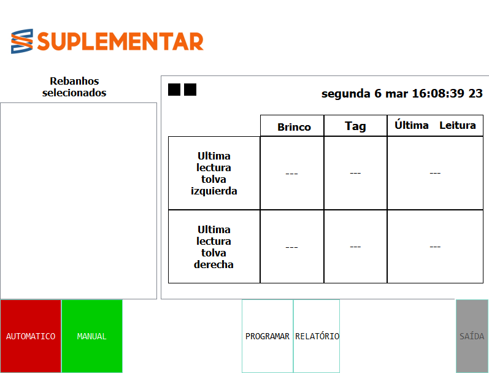
   
   Tela Principal

**Definição de Rodeios**

Para definir os rodeios, clique no botão **Adicionar ou Remover Rodeios** na tela de programação principal.

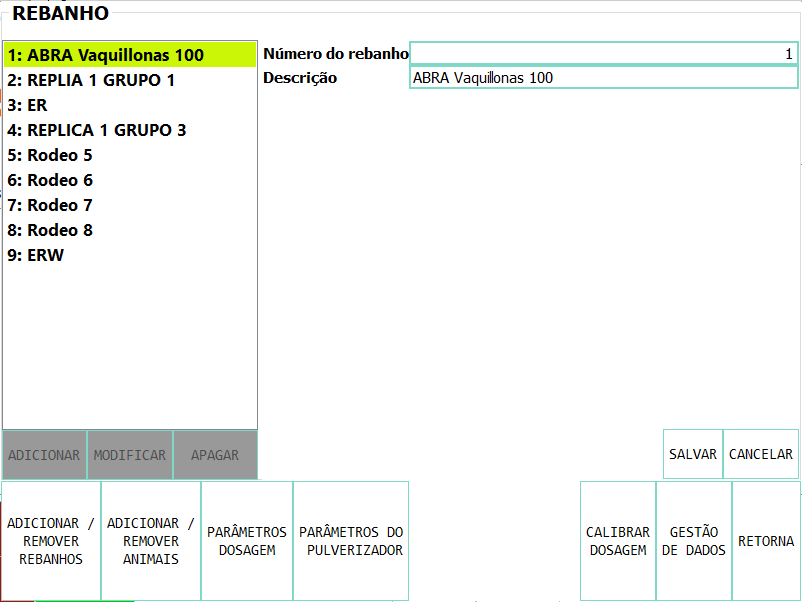
   
   Tela para agendar rodeios

Clicar em **Adicionar** exibe o menu para criar um novo Rodeio, onde podemos definir um número de identificação e uma descrição. 
Clicar em **Salvar** o rodeio será definido. Também é possível modificar os dados de um rodeio ou excluí-los, selecionando-os 
na lista e pressionando o botão **Modificar** ou **Excluir**.

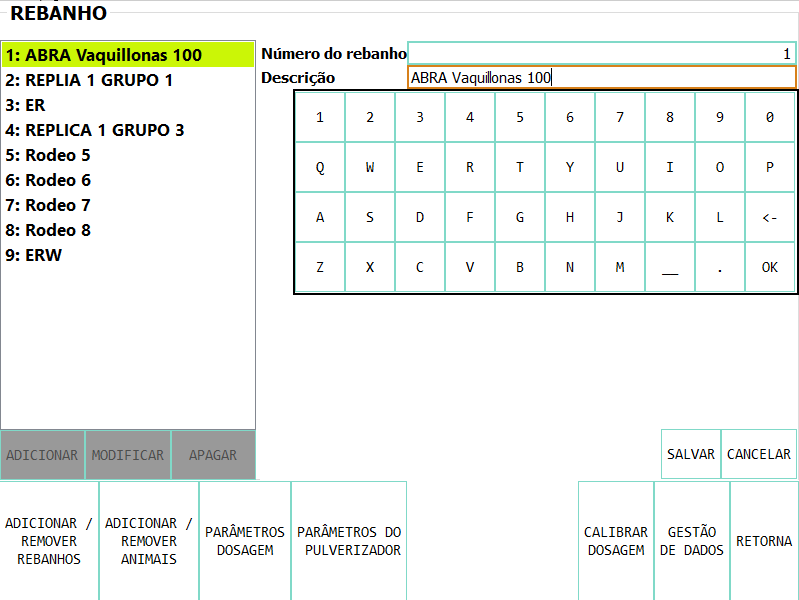
   
   Tela para adicionar ou modificar rodeios

**Definição de Animais**

|O próximo passo será adicionar os *Animais* ao rodeio. Para isso, devemos pressionar o botão **Adicionar / Remover Animais**, onde 
 selecionaremos o rodeio da lista existente, digitaremos o *Numero de Brinco* (por exemplo, cartão de caravanas ou identificação própria) e  
 o *Numero Id eletrônica* (número que tem a caravana eletrônica impressa).
|Selecionar salvar registra os dados. Este processo é repetido para incorporar todos os animais aos quais você deseja suplementar.
|Uma vez salvos, os animais são listados à esquerda, onde aparece o número do rodeio, seguido da identificação e do número da etiqueta.
|Você pode modificar os dados de um animal ou excluí-los selecionando-os na lista.

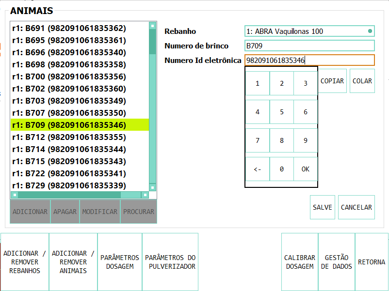
   
   Tela para adicionar animais

**Busca de Animais**

| Também é possível procurar animais já carregados para modificar os dados ou alterá-los do rodeio. É possível procurar um animal por
 Numero de Brinco ou por Id eletrônica (número eletrônico da caravana).
| Se o animal existir com os dados inseridos no banco de dados, ele será selecionado da lista de animais para modificação.

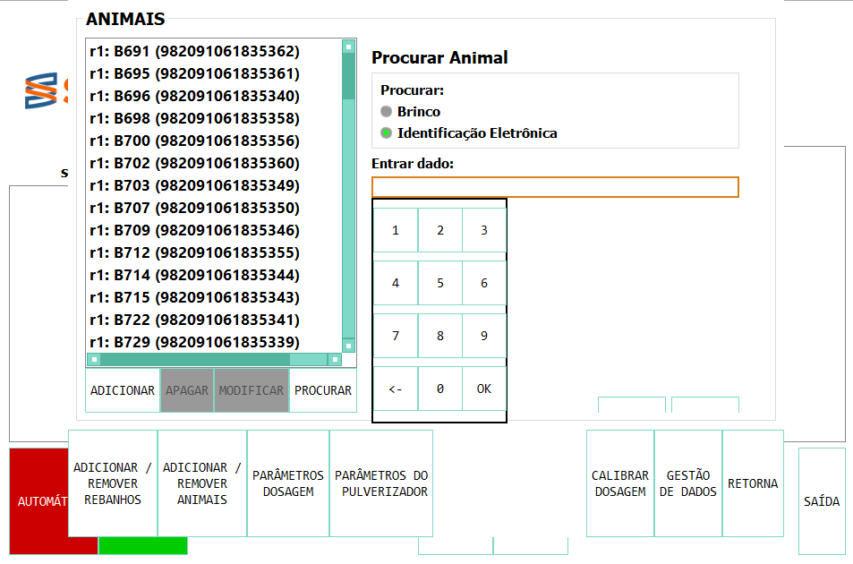
   
   Tela de Pesquisa de Animais

**Parâmetros de Alimentação**

| O próximo passo é definir os parâmetros de alimentação do rodeio. Para fazer isso, clique em **Parâmetros de dosagem**.
| Os parâmetros de alimentação podem ser definidos por rodeio, ou seja, de forma grupal para todos os animais que o integram ou individualmente, ou seja,
 parâmetros especiais apenas para este animal. Ao entrar na tela de dosagem aparecerá uma lista contendo os rodeios existentes destacados em azul e sob cada
 rodeio os animais que eles contêm são mostrados através de sua caravana física.
| Se os animais não estiverem destacados na lista, isso significa que ele será guiado pela definição do grupo, mas se um animal for destacado em verde, isso
 significa que ele atribuiu parâmetros de suplementação individuais. O rodeio ou animal que você selecionar será destacado em amarelo, assim como nas outras telas.
| Para definir os parâmetros para todo o grupo (por rodeio) selecione o rodeio na lista e pressione o botão **Modificar**.

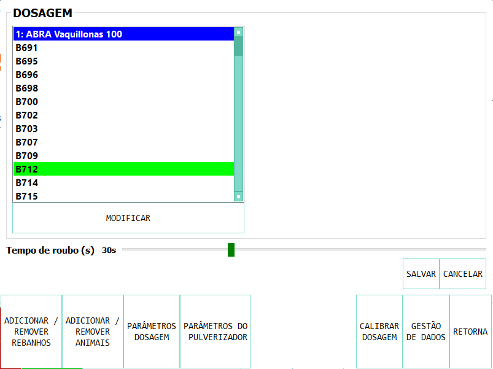
   
   Tela principal dos parâmetros de Alimentação

| Na tela que se abre, insira o número de quilos de alimentos por dia e o número de doses por dia ou frações.
| Ao mesmo tempo, é definido um intervalo mínimo entre as frações, o que permite que as rações sejam espaçadas no dia. Este parâmetro é o tempo medido em segundos que
 deve passar minimamente, para autorizar uma refeição após a anterior.
| Ao selecionar um animal da lista, é possível alterar os parâmetros de dosagem de uma maneira *particular* para a qual a possibilidade de marcar a caixa **Tratar como
 animal individual** é ativada.
| Se a caixa de seleção estiver marcada, é possível salvar as alterações especificamente para esse animal. 

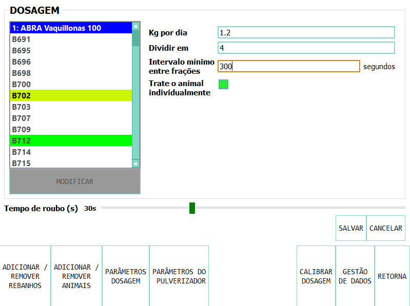
   
   Exibição de parâmetros de Alimentação

**Identificação de Roubos**

| Como qualquer grupo social, existem animais dominantes, que às vezes tentam roubar a comida de outro animal, correndo-a da saída.
| Para isso o equipamento conta com barras de proteção, porém, mesmo com essa proteção alguns animais dominantes conseguem movimentar o animal e entrar na boca quando ainda há
 alimento do animal que está se alimentando.
| Para registrar esses comportamentos, há um parâmetro chamado Tempo de Roubo. Esse parâmetro é calculado em relação ao tempo, em segundos, que o animal leva para comer a fração
 fornecida.
| É aconselhável calcular o tempo de roubo em 75% do tempo que leva para um animal levantar a ração. Os estudos que realizamos nos aconselham a calcular 10 segundos por 100gr.
| Por exemplo, para frações de 200 gramas, um tempo de roubo de 20 segundos é calculado, embora o animal passe mais tempo no ponto de expedição, ele já terminou de comer.
| O equipamento de suplementação permite identificar as situações de roubo e os animais que apresentam esse comportamento medindo a quantidade de alimentos roubados em porcentagem
 de suplementação diária.
| Ou seja, a equipe nos diz quanto mais comida está comendo em relação ao que deveria comer. Poderemos ver os animais que roubaram e o número de vezes que o fizeram nos relatórios.
| É importante esclarecer que os dados de roubo não são dados precisos de consumo de alimentos, uma vez que os animais entram e saem na luta, mas são dados comportamentais precisos.
| Para definir o tempo de roubo, você deve pressionar o botão Parâmetros Gerais na tela principal.

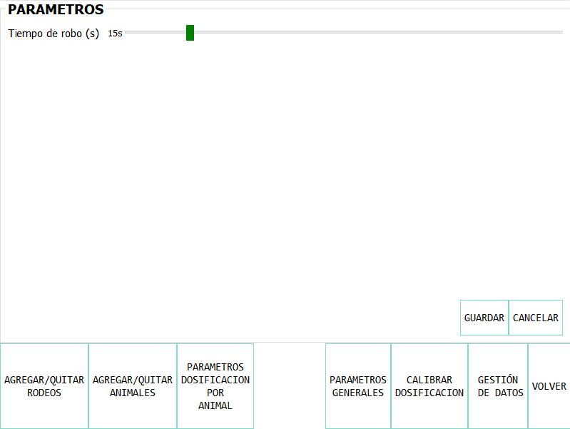
   
   Tela de parâmetros gerais

Calibração de dosagem
---------------------

| A calibração da dosagem deve ser realizada apenas na primeira vez antes do uso ou em caso de alteração do tipo de suplemento.
| Você entra na tela pressionando **Calibrar Dosagem** na tela de programação principal e, em seguida, **Iniciar calibração**, selecionando a saída correspondente que deseja calibrar.
| Você precisa de uma balança de cozinha e um recipiente, que deve ser pesado na balança antes de começar. O recipiente é colocado na boca e pressionar **Continuar**, automaticamente a
 máquina fornece alimentos, o mesmo é pesado e esses dados são inseridos na tela.
| Este processo é repetido 3 vezes para precisão. O equipamento ajusta automaticamente os parâmetros para que a quantidade apropriada seja fornecida no modo de operação normal.
| A margem de erro no fornecimento do dispensador dependerá da apresentação do alimento, é entre 3 a 7%.

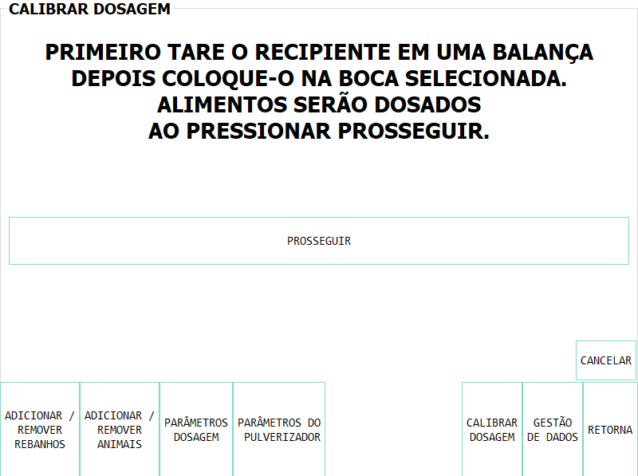
   
   Tela de calibração

Modo de Operação Automática
---------------------------

| Para deixar o equipamento em funcionamento, ou seja, aguardar a entrada dos animais para alimentá-los, o modo de funcionamento automático deve ser ativado.
| Isso é feito pressionando o botão **Automático** na tela principal e selecionando os rodeios que você deseja deixar ativos, ou seja, a equipe fornecerá o suplemento para todos os
 animais que estiverem dentro do rodeio ou rebanhos selecionados.
| Enquanto o equipamento estiver nessa modalidade ele registrará todos os dados da operação, ou seja, para cada animal que entrar com uma caravana eletrônica, ele armazenará todas
 as informações em um banco de dados, ou seja: qual animal entrou,
 em que horário chegou, quanta comida foi fornecida e se houve roubo e, em caso afirmativo, qual animal roubou.

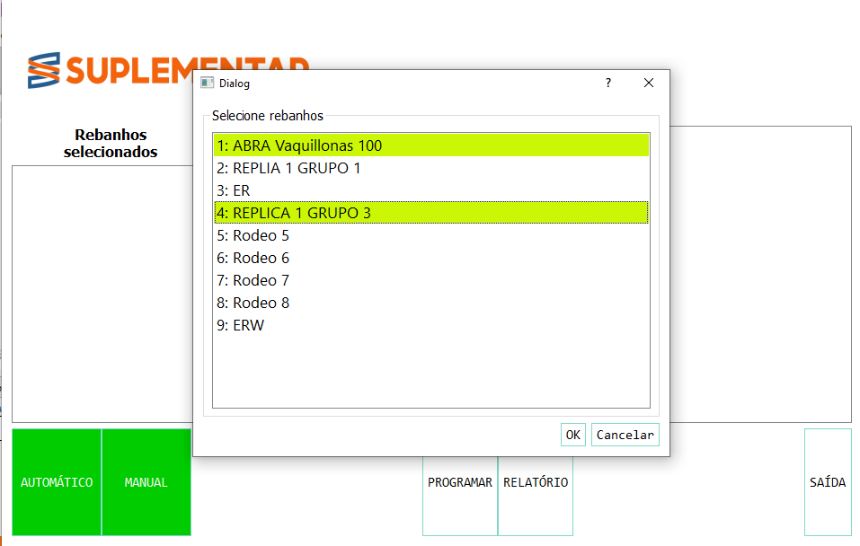
   
   Tela de ativação do modo automático

No modo de operação automática, o equipamento mostra em sua tela as informações sobre as últimas admissões em cada boca de alimentação, incluindo o número da caravana física do animal 
que entrou; O seu número de caravana eletrônica e registo, que descreve a operação que está a ser realizada.

O registro das operações pode exibir os seguintes status:

* **Dosagem**
 
Esta legenda é mostrada ao fornecer o alimento e inclui: o número da fração diária; o número configurado de frações; A quantidade de suplemento entregue; o conjunto de ração diária 
e a percentagem que representa.

* **Alimentação Completa**

Esta legenda é exibida quando o animal já recebeu todas as frações configuradas e não recebe comida.

* **Roubo registrado**

Esta legenda é mostrada quando um roubo é detectado, ou seja, quando um suplemento é administrado a um animal e dentro do período configurado e outro animal entra. Esta situação é identificada 
como um roubo que é imputado ao segundo animal.

* **Rodeio errado**

Esta legenda é mostrada quando o animal que você inseriu está registrado no banco de dados, mas está em um rebanho que não foi selecionado para ser complementado no momento da ativação 
do equipamento. Isso não significa que representa um erro, mas é relatado para que o usuário possa conhecer a situação e para que ele possa verificar se não é um erro de upload de dados

* **Não existe**

Essa legenda é mostrada quando o animal que entrou não está cadastrado no banco de dados, ou seja, o número da caravana eletrônica não foi registrado em nenhum rodeio. Como a situação anterior, 
ele é relatado para que o usuário possa conhecer a situação e para que ele possa verificar se não é um erro de carregamento de dados.

Gerenciamento de dados
----------------------

| Ao pressionar o botão **Gerenciamento de Dados** na tela de  programação, você acessa essa tela que permite executar uma série de operações relacionadas ao gerenciamento dos dados gravados.
| O primeiro botão **USB Data BackUp** que permite gravar uma cópia do banco de dados do computador em um pendrive conectado à porta USB.
| A segunda opção é **Restaurar Dados de USB** em que ocorre a operação inversa, ou seja, o computador é configurado com os dados salvos anteriormente em um dispositivo de armazenamento.

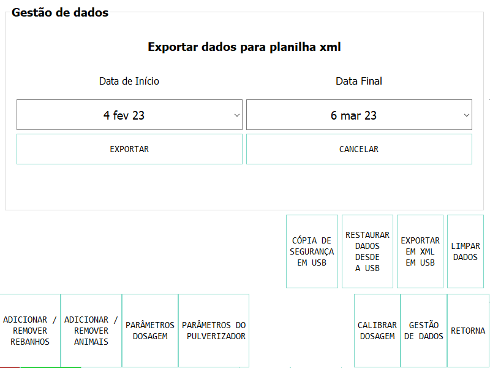
   
   Tela de gerenciamento de dados – Exportar para em formato XML

| A seguinte opção de **Exportar em XLM em USB** permite que você salve os dados do equipamento em um formato XLM para poder visualizá-lo em uma planilha (Excel).
| Esta opção regista na primeira aba os rodeios definidos e o número de animais que contêm; Nas abas a seguir as informações dos animais de cada rebanho e os parâmetros de alimentação configurados
 para cada um e, por fim, uma aba com todos os registros de alimentação registrados pelo equipamento dentro do período selecionado na tela.
| Cada registro inclui a caravana física e eletrônica do animal que entrou; o rodeio a que pertence; a quantidade de suplemento administrado; A data e a hora de administração e a classificação acima
 descrita, ou seja, se se tratava de uma refeição normal, de um roubo, de um animal de um rodeio inativo ou de um animal não registado na base de dados.

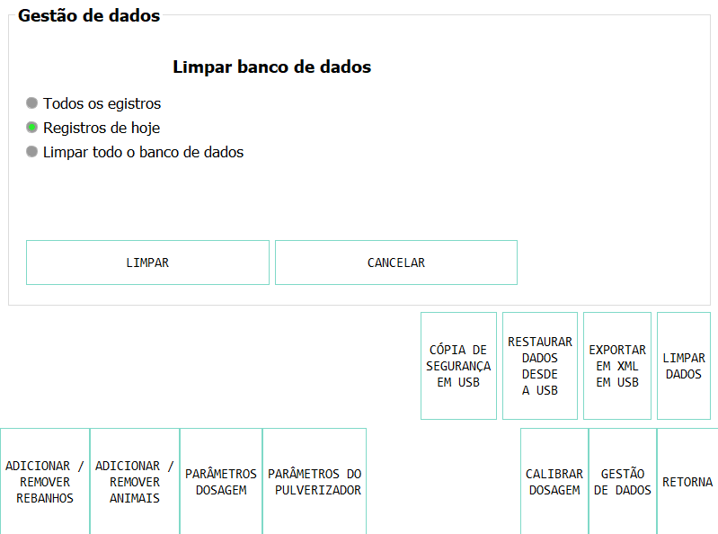
   
   Tela de Gerenciamento de Dados – Dados Limpos

A última opção é **Limpar dados**. Esta opção permite-lhe eliminar os dados que se acumulam devido à programação ou ao longo do funcionamento do equipamento. A primeira possibilidade é excluir todos 
os registros alimentares, mas manter a definição de Rodeios, Animais e Parâmetros de Alimentação. A segunda possibilidade é apagar absolutamente todos os dados e deixar o computador como ele sai da fábrica.

.. _reportes:

Relatórios
==========

Informações sobre o funcionamento do equipamento e a ração fornecida aos animais podem ser acessadas pressionando o botão **Relatórios**  na tela principal.

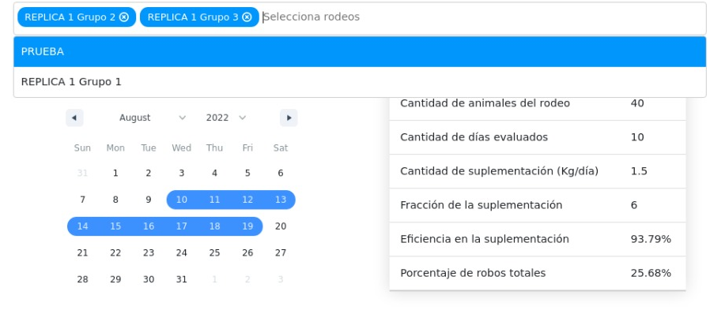
   
   Tela de Relatório, seleção de Rodeios e Datas

Como primeiro passo, devemos selecionar o rodeio ou rodeios para os quais queremos gerar o relatório. Também devemos selecionar o período, pressionando a data de início e término no calendário.

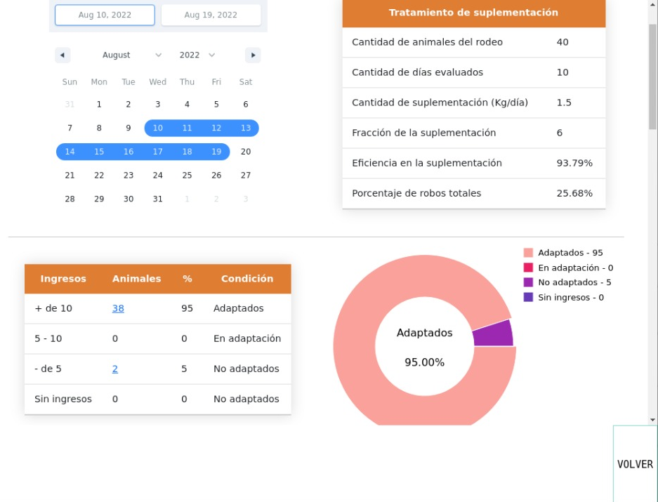
   
   Tela de Relatório – Fatos Importantes

| A primeira tabela do relatório mostra-nos dados gerais: o(s) efectivo(s) seleccionado(s), o número de animais que contêm e os parâmetros de dosagem utilizados.
| Também mostra a eficiência geral de suplementação do equipamento durante esse período. Este parâmetro é a razão entre o número de vezes que o equipamento realmente forneceu
 uma ração para o número máximo de vezes que o equipamento poderia ter funcionado. Por exemplo, se selecionarmos um período de 20 dias e se houver 100 animais no rodeio
 habilitados com 5 porções por dia, o número máximo de vezes que o equipamento pode funcionar é de 20 dias x 100 animais x 5 porções = 10.000 vezes. Assim, se o equipamento
 marca uma eficiência global de 83%, isso significa que no período selecionado ele administrou alimentos cerca de 8.300 vezes.
| Mostra também o percentual total de roubos registrados em relação ao peso do total de alimentos fornecidos.

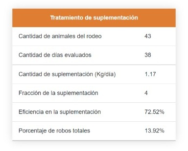
   
   Tabela de Relatórios Gerais

O relatório mostra em uma tabela a classificação dos animais de acordo com os horários em que receberam alimentos. Esta tabela serve para avaliar o processo de adaptação, uma 
vez que os animais são classificados como *Adaptados* se tiverem recebido alimento mais  de 10 vezes, *Em adaptação* se tiverem recebido entre 5 e 10 porções e *Não Adaptados* se 
tiverem recebido suplementação inferior a 5 vezes ou não tiverem entrado. 

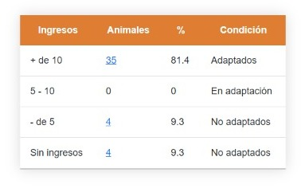
   
   Tabela de Adaptação Animal

A próxima tabela mostrada no relatório é uma tabela de dupla entrada, que permite uma avaliação mais detalhada. O primeiro critério utilizado é a percentagem global de rações 
recebidas de cada animal e o segundo critério é a percentagem de dias em que o animal utilizou o equipamento.

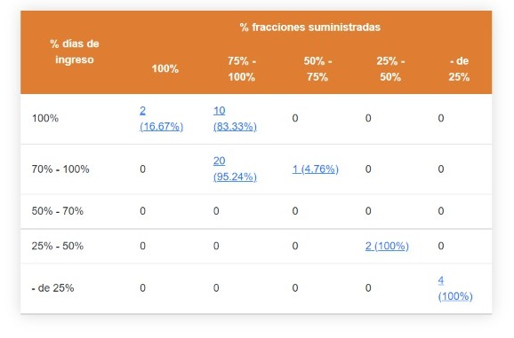
   
   Tabela de dupla entrada de Adaptação Animal

Abaixo está uma tabela que permite quantificar o roubo de rações e uma lista dos animais que foram roubados, que mostra a porcentagem de alimentos roubados de cada um, com relação 
à quantidade atribuída, encomendada do maior para o menor. Isso permite avaliar as situações de roubo e tomar decisões em relação aos animais que apresentam esse comportamento, 
como baixar a dose individual ao mínimo ou retirá-los do rodeio.

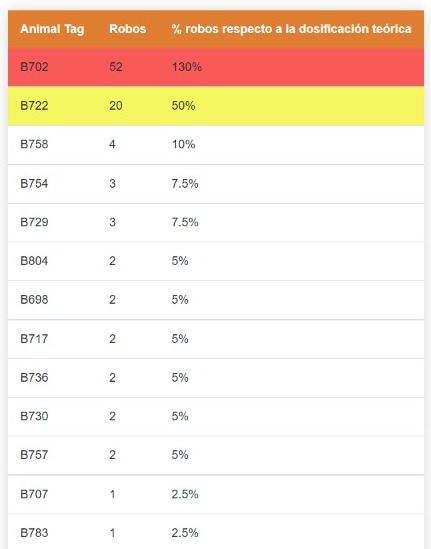
   
   Tabela de Registro de Roubo

No final há uma tabela contendo os animais que entraram na boca de alimentação que foram carregados em rodeios que na época não estavam autorizados a fornecer alimento. Além disso, 
é mostrada uma tabela de animais que entraram para comer cujos números de caravanas eletrônicas não foram registrados no banco de dados. Essas informações são exibidas para que o 
usuário possa verificar se não é um erro de carregamento de dados. Você pode salvar o relatório em um arquivo PDF em uma unidade flash pressionando o botão **Salvar PDF**.

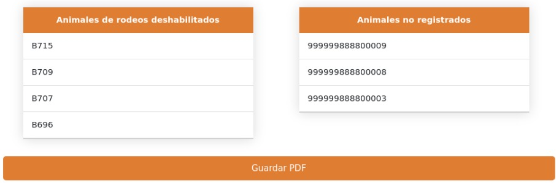
   
   Tabela de Animais em Rodeios Deficientes, Animais Não Registrados e Salvos em formato PDF

**Conectando dispositivos ao suplemento**

É possível conectar telefones ou dispositivos ao Suplementador via Wi-Fi com a finalidade de gerar, visualizar, gravar ou compartilhar relatórios. Para isso, você deve conectar 
seu dispositivo à rede chamada "Suplemento" e entrar na página "www.suplementar.tkx", onde você pode ver as mesmas telas de relatórios como se estivesse visualizando a tela do suplemento. 
A partir do seu dispositivo, você pode salvar o relatório em formato PDF pressionando o botão Salvar PDF. Em seguida, você pode compartilhá-lo por e-mail ou mensagens.

Detalhes de Contato
-------------------

**Contato Direto**

Para informações comerciais, contacte:

E-mail: info@suplementarsas.com

Telefone: +54 - 9 - 351 7305203 Dario Irico

Para consultas de assistência técnica, entre em contato com:

E-mail: asistencia@suplementarsas.com

Telefone: +54 - 9 - 351 3599649 José Luperi

**Página Web**

.. _Site: https://www.suplementarsas.com/

Você pode ver mais informações em nosso Site_.

**Instagram**

.. _Instagram: https://www.instagram.com/suplementarsas/?igshid=YmMyMTA2M2Y=

Você também pode nos encontrar em nosso Instagram_.

